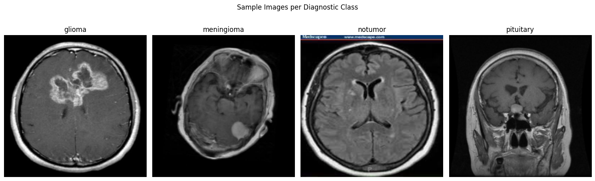
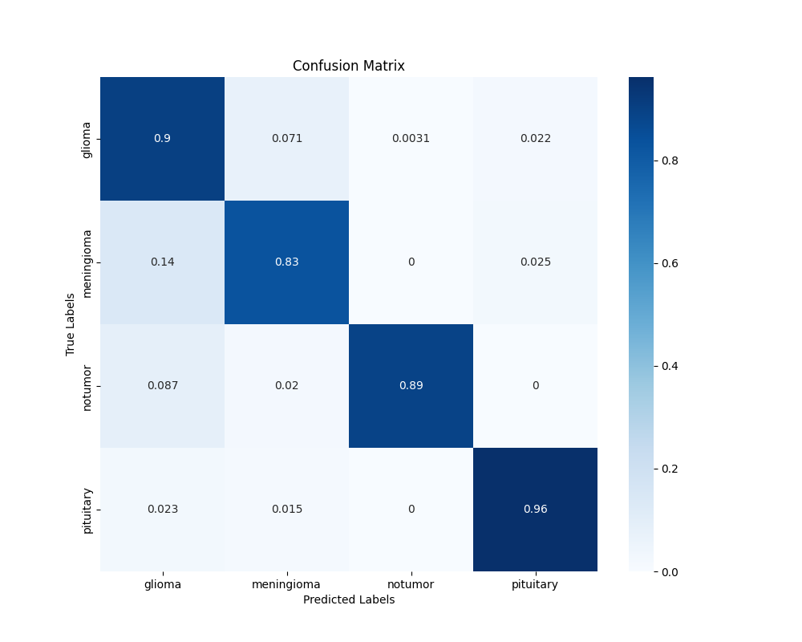

## Brain Tumor Classification using EfficientNet b8

This repository implements a deep learning pipeline for brain tumor classification from MRI images, using and comparing different EfficientNet architectures.

# Results 

The table below summarizes the performance of different EfficientNet architectures on the classification task, reporting accuracy, F1 score, recall, and precision for each model
| Model  | Accuracy | F1 score | Recall | Precision |
| ------------- | ------------- | ------------- | -------------| ------------- | 
| EfficientNetB4  | 0.856 | 0.851  | 0.856 | 0.867  |
| EfficientNetB5  | 0.897 | 0.838  | 0.843 | 0.843  |
| EfficientNetB6  | 0.897 | 0.894  | 0.897 | 0.896  |
| EfficientNetB7  | 0.867 | 0.862  | 0.866 | 0.863  |
| EfficientNetB8  | 0.896 | 0.894  | 0.896 | 0.899  |

### Confusion Matrix of EfficientNetB8 

